# 🏗 Application Architecture

This document describes the high-level architecture of the DZR application, its modular structure,
and the interaction principles between modules.

## 🧩 Modularization Strategy

The project implements a strict modular architecture to ensure separation of concerns, scalability,
and build performance.

```mermaid
graph TD
    App[":app"] --> Feature[":feature:*"]
    App --> Core[":core:*"]
    
    Feature --> LibraryDomain[":library:*:domain"]
    Feature --> Core
    
    LibraryData[":library:*:data"] --> LibraryDomain
    LibraryData --> Core
    
    LibraryDomain --> Core
    
    subgraph "Core Layer"
        CoreCommon[":core:common"]
        CoreNetwork[":core:network"]
        CoreDesign[":core:design-system"]
        CoreModel[":core:model"]
    end
```

### Module Types

| Type        | Pattern              | Responsibility                                                                  | Dependencies Rule                                           |
|-------------|----------------------|---------------------------------------------------------------------------------|-------------------------------------------------------------|
| **Root**    | `app`, `build-logic` | Entry point, DI graph assembly, Navigation, Build logic.                        | Depends on everything.                                      |
| **Feature** | `feature:*`          | User-facing screens and flows (e.g., Search, Player).                           | `core:*`, `library:*:domain`. **No circular dependencies.** |
| **Library** | `library:*`          | Reusable business entities (e.g., Track, Artist). Split into `domain` & `data`. | `core:*`, other `library:*:domain`.                         |
| **Core**    | `core:*`             | Cross-cutting infrastructure & utilities (Network, UI Kit).                     | Only other `core:*` modules.                                |

---

## 📦 Module Structure Detail

<strong>Root Modules</strong>

* `app`: The executable application. Binds implementations to interfaces using DI (Koin).
* `build-logic:convention`: Custom Gradle plugins for consistent build configuration across modules.

<strong>Core Modules</strong>

* `core:common`: Basic utilities (Result wrapper, Coroutine dispatchers).
* `core:model`: Shared domain models used across the entire app.
* `core:network`: Low-level networking (Retrofit, OkHttp, Interceptors).
* `core:auth`: Authorization logic (OAuth, Token management). Split into `domain` and `data`.
* `core:data`: Common repository implementations.
* `core:design-system`: UI Kit (Theme, Components, Icons).
* `core:ui`: Shared Compose UI logic not strictly part of the design system.
* `core:testing`: Shared testing infrastructure (Rules, Fakes).

<strong>Library Modules</strong>

Each library represents a business domain entity.

* `library:album`
* `library:artist`
* `library:track`
* `library:playlist`
* `library:player`
* `library:user`

Each is split into:

* `:domain`: Pure Kotlin, interfaces, models.
* `:data`: Android/JVM, implementations, repositories, API calls.

<strong>Feature Modules</strong>

* `feature:auth`: Login/Auth flow.
* `feature:player`: Player screen.
* `feature:search`: Search functionality.
* `feature:album`: Album details.
* `feature:artist`: Artist details.
* `feature:playlist`: Playlist details.

---

## 📂 Package Structure Standards

### `app`

* `com.music.dzr.di`: Koin module assembly.
* `com.music.dzr.navigation`: Root `NavHost` and navigation graph.
* `com.music.dzr.ui`: `MainActivity` and app-level UI state.

### `core:network`

* `di`: Koin modules for Network components.
* `dto`: Generic network transfer objects.
* `retrofit`: Call adapters and converters.
* **Note**: Does not depend on `core:auth`. Auth headers are injected via interceptors.

### `core:auth`

* `domain.model`: OAuth tokens, scopes.
* `domain.repository`: `AuthRepository` interface.
* `data.remote`: OAuth API definitions and DTOs.
* `data.local`: Token storage (DataStore/EncryptedSharedPreferences).

### `library:*:domain`

* `model`: Domain entities (e.g., `Track`).
* `repository`: Repository interfaces (e.g., `TrackRepository`).
* `usecase`: Reusable business logic (Interactors).

### `library:*:data`

* `di`: Koin modules binding Repositories.
* `repository`: Implementation of domain repositories.
* `remote.api`: Retrofit interfaces.
* `remote.dto`: Network response models.
* `mapper`: Mappers (DTO -> Domain).
* `local` (Optional): Room DAOs or DataStore definitions.

### `feature:*`

* `ui.screen`: Composable screens, ViewModels, UiState.
* `ui.component`: Feature-specific UI components.
* `ui.navigation`: Navigation route definitions.
* `ui.di`: Koin modules for ViewModels.
* `domain/data` (Optional): Feature-specific logic not shared with other modules.

---

## 🔄 Data Flow

The application follows **Unidirectional Data Flow (UDF)**.

1. **UI Layer** (`feature`): Observes `UiState` from ViewModel. Sends `Events` to ViewModel.
2. **ViewModel**: Handles events, executes `UseCases`.
3. **Domain Layer** (`library:domain`): Pure business logic.
4. **Data Layer** (`library:data`): Fetches data from Remote (API) or Local (DB) sources.
5. **State Update**: Data flows back up to the UI via `Flow` or `State`.
